  # DOCUMENTATION OF PROJECT 14

  ## INTRODUTION

In this project, the concept of CI/CD is implemented whereby php application from github are pushed to Jenkins to run a multi-branch pipeline job(build job is run on each branches of a repository simultaneously) which is better viewed from Blue Ocean plugin.  This is done in order to achieve continuous integration of codes from different developers. After which the artifacts from the build job is packaged and pushed to sonarqube server for testing before it is deployed to artifactory from which ansible job is triggered to deploy the application to production environment.

The following are the steps taken to achieve this:

## STEP 1:  Configuring Ansible For Jenkins Deployment

Installing Blue Ocean plugin from ‘manage plugins’ on Jenkins:
- Creating new pipeline job on the Blue Ocean UI from Github
- Generating new personal access token in order to full access to the repository
- Pasting the token and selecting ansible-config-mgt repository to create a new pipeline job


- Creating a directory in the root of ansible-config-mgt directory called **deploy**, and creating a file in it called **Jenkinsfile**.
- Switching to new branch called **feature/Jenkinspipeline-stages**


- Entering the following codes in the Jenkinsfile which does nothing but echo with shell script:
```
pipeline {
  agent any

  stages {
    stage('Build') {
      steps {
        script {
          sh 'echo "Building Stage"'
        }
      }
    }

    stage('Test') {
      steps {
        script {
           sh 'echo "Testing Stage"'
        }
      }
    }

    stage('Package') {
      steps {
        script {
          sh 'echo "Testing Stage"'
        }
      }
    }

    stage('Deploy') {
      steps {
        script {
          sh 'echo "Testing Stage"'
        }
      }
    }

    stage('Clean up') {
      steps {
        script {
          sh 'echo "Testing Stage"'
        }
      }
    }
  }
}
```
Commit ab=nd push the changes then we go to jenkins to configure the location of the file.
In the pipeline we just created go to configure in the **Build Configuration** section and specify the location of the Jenkinsfile at **deploy/Jenkinsfile**

Now we go back to our pipeline and click build now.This will trigger a build and we'll able to see our changes if all configuration is well.

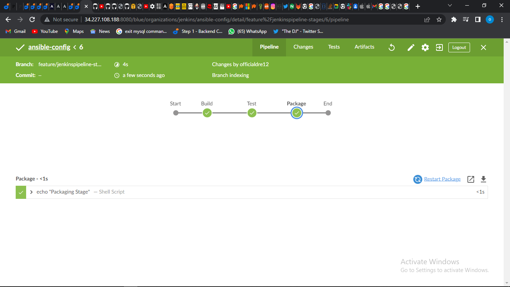

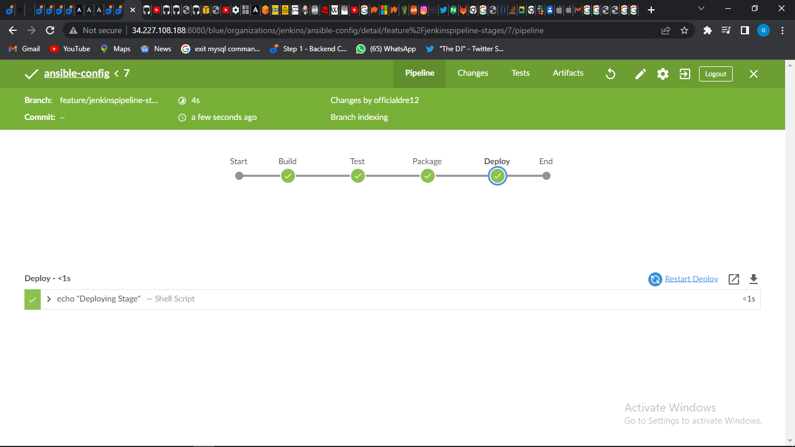

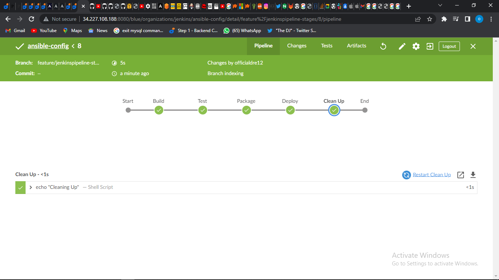

Now we merge the changes to main branch and move to the next step.

 ## RUNNING ANSIBLE PLAYBOOK FROM JENKINS
- Installing Ansible plugin from **manage plugins** on Jenkins 
to run ansible commands
- Clearing the codes in the Jenkinsfile to start from the scratch
- For ansible to be able to locate the roles in my playbook, the ansible.cfg is copied to '/deploy' folder and then exported from the Jenkinsfile code

The structure of the ansible-config-mgt 

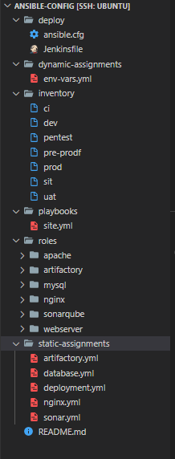

Using the jenkins pipeline syntax Ansible tool to generate syntax for executing playbook which runs with tags 'webserver'.

Now we introduce parametization.To deploy to other environments, we will need to use parameters.

Update other inventory files with new servers.

Update Jenkinsfile to introduce parameterization. Below is just one parameter. It has a default value in case if no value is specified at execution.

```
pipeline {
    agent any

    parameters {
      string(name: 'inventory', defaultValue: 'dev',  description: 'This is the inventory file for the environment to deploy configuration')
    }
...
```
In the Ansible execution section, remove the hardcoded **inventory/dev** and replace with **`${inventory}**
From now on, each time you hit on execute, it will expect an input.


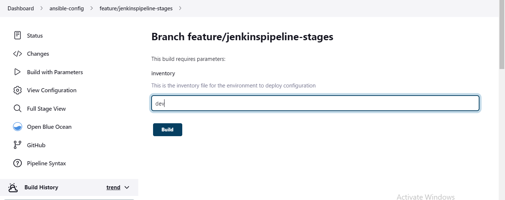


We already have tooling website as a part of deployment through Ansible. Now we would be working **CI/CD pipeline for TODO application**

We would deploy the application onto servers directly from Artifactory instead of GIT so we need to set up our artifactory server. Create or get Artifactory role.

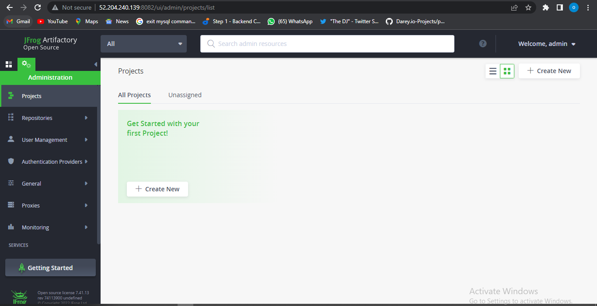
Succesfuly set up artifactory using ansible roles.

Now we prepare jenkins.
- Firstly we fork the TODO repository into our github account.
- On you Jenkins server, install PHP, its dependencies and Composer tool `sudo apt install -y zip libapache2-mod-php phploc php-{xml,bcmath,bz2,intl,gd,mbstring,mysql,zip}`
-  Install Artifactory and plot plugins in Jenkins ui
We will use plot plugin to display tests reports, and code coverage information.
The Artifactory plugin will be used to easily upload code artifacts into an Artifactory server.

Now we configure artifactory to connect to jenkins. Configure the server ID, URL and Credentials and run Test Connection.

Now we integrate Artifactory repository with Jenkins.

Create a Jenkinsfile in the repository
Using Blue Ocean, create a multibranch Jenkins pipeline 
On the database server, create database and user.

Update the jenkins file with proper configuration.

```
pipeline {
    agent  { label 'slavenode1' }

  stages {

     stage("Initial cleanup") {
          steps {
            dir("${WORKSPACE}") {
              deleteDir()
            }
          }
        }

    stage('Checkout SCM') {
      steps {
            git branch: 'main', url: 'https://github.com/dreyabraham/php-todo.git'
      }
    }

    stage('Prepare Dependencies') {
      steps {
             sh 'mv .env.sample .env'
             sh 'composer install'
             sh 'php artisan migrate'
             sh 'php artisan db:seed'
             sh 'php artisan key:generate'
      }
    }
 
     stage('Execute Unit Tests') {
      steps {
             sh './vendor/bin/phpunit'
      }
    }    
      stage('Code Analysis') {
       steps {
        sh 'phploc app/ --log-csv build/logs/phploc.csv'

      }
    }
  
      stage('Plot Code Coverage Report') {
       steps {

          plot csvFileName: 'plot-396c4a6b-b573-41e5-85d8-73613b2ffffb.csv', csvSeries: [[displayTableFlag: false, exclusionValues: 'Lines of Code (LOC),Comment Lines of Code (CLOC),Non-Comment Lines of Code (NCLOC),Logical Lines of Code (LLOC)                          ', file: 'build/logs/phploc.csv', inclusionFlag: 'INCLUDE_BY_STRING', url: '']], group: 'phploc', numBuilds: '100', style: 'line', title: 'A - Lines of code', yaxis: 'Lines of Code'
          plot csvFileName: 'plot-396c4a6b-b573-41e5-85d8-73613b2ffffb.csv', csvSeries: [[displayTableFlag: false, exclusionValues: 'Directories,Files,Namespaces', file: 'build/logs/phploc.csv', inclusionFlag: 'INCLUDE_BY_STRING', url: '']], group: 'phploc', numBuilds: '100', style: 'line', title: 'B - Structures Containers', yaxis: 'Count'
          plot csvFileName: 'plot-396c4a6b-b573-41e5-85d8-73613b2ffffb.csv', csvSeries: [[displayTableFlag: false, exclusionValues: 'Average Class Length (LLOC),Average Method Length (LLOC),Average Function Length (LLOC)', file: 'build/logs/phploc.csv', inclusionFlag: 'INCLUDE_BY_STRING', url: '']], group: 'phploc', numBuilds: '100', style: 'line', title: 'C - Average Length', yaxis: 'Average Lines of Code'
          plot csvFileName: 'plot-396c4a6b-b573-41e5-85d8-73613b2ffffb.csv', csvSeries: [[displayTableFlag: false, exclusionValues: 'Cyclomatic Complexity / Lines of Code,Cyclomatic Complexity / Number of Methods ', file: 'build/logs/phploc.csv', inclusionFlag: 'INCLUDE_BY_STRING', url: '']], group: 'phploc', numBuilds: '100', style: 'line', title: 'D - Relative Cyclomatic Complexity', yaxis: 'Cyclomatic Complexity by Structure'      
          plot csvFileName: 'plot-396c4a6b-b573-41e5-85d8-73613b2ffffb.csv', csvSeries: [[displayTableFlag: false, exclusionValues: 'Classes,Abstract Classes,Concrete Classes', file: 'build/logs/phploc.csv', inclusionFlag: 'INCLUDE_BY_STRING', url: '']], group: 'phploc', numBuilds: '100', style: 'line', title: 'E - Types of Classes', yaxis: 'Count'
          plot csvFileName: 'plot-396c4a6b-b573-41e5-85d8-73613b2ffffb.csv', csvSeries: [[displayTableFlag: false, exclusionValues: 'Methods,Non-Static Methods,Static Methods,Public Methods,Non-Public Methods', file: 'build/logs/phploc.csv', inclusionFlag: 'INCLUDE_BY_STRING', url: '']], group: 'phploc', numBuilds: '100', style: 'line', title: 'F - Types of Methods', yaxis: 'Count'
          plot csvFileName: 'plot-396c4a6b-b573-41e5-85d8-73613b2ffffb.csv', csvSeries: [[displayTableFlag: false, exclusionValues: 'Constants,Global Constants,Class Constants', file: 'build/logs/phploc.csv', inclusionFlag: 'INCLUDE_BY_STRING', url: '']], group: 'phploc', numBuilds: '100', style: 'line', title: 'G - Types of Constants', yaxis: 'Count'
          plot csvFileName: 'plot-396c4a6b-b573-41e5-85d8-73613b2ffffb.csv', csvSeries: [[displayTableFlag: false, exclusionValues: 'Test Classes,Test Methods', file: 'build/logs/phploc.csv', inclusionFlag: 'INCLUDE_BY_STRING', url: '']], group: 'phploc', numBuilds: '100', style: 'line', title: 'I - Testing', yaxis: 'Count'
          plot csvFileName: 'plot-396c4a6b-b573-41e5-85d8-73613b2ffffb.csv', csvSeries: [[displayTableFlag: false, exclusionValues: 'Logical Lines of Code (LLOC),Classes Length (LLOC),Functions Length (LLOC),LLOC outside functions or classes ', file: 'build/logs/phploc.csv', inclusionFlag: 'INCLUDE_BY_STRING', url: '']], group: 'phploc', numBuilds: '100', style: 'line', title: 'AB - Code Structure by Logical Lines of Code', yaxis: 'Logical Lines of Code'
          plot csvFileName: 'plot-396c4a6b-b573-41e5-85d8-73613b2ffffb.csv', csvSeries: [[displayTableFlag: false, exclusionValues: 'Functions,Named Functions,Anonymous Functions', file: 'build/logs/phploc.csv', inclusionFlag: 'INCLUDE_BY_STRING', url: '']], group: 'phploc', numBuilds: '100', style: 'line', title: 'H - Types of Functions', yaxis: 'Count'
          plot csvFileName: 'plot-396c4a6b-b573-41e5-85d8-73613b2ffffb.csv', csvSeries: [[displayTableFlag: false, exclusionValues: 'Interfaces,Traits,Classes,Methods,Functions,Constants', file: 'build/logs/phploc.csv', inclusionFlag: 'INCLUDE_BY_STRING', url: '']], group: 'phploc', numBuilds: '100', style: 'line', title: 'BB - Structure Objects', yaxis: 'Count'

      }
    }

      stage ('Package Artifact') {
       steps {
            sh 'zip -qr php-todo.zip ${WORKSPACE}/*'
      }
    }
      stage ('Upload Artifact to Artifactory') {
          steps {
            script { 
                 def server = Artifactory.server 'artifactory-server'                 
                 def uploadSpec = """{
                    "files": [
                      {
                       "pattern": "php-todo.zip",
                       "target": "PBL/php-todo",
                       "props": "type=zip;status=ready"

                       }
                    ]
                 }""" 

                 server.upload spec: uploadSpec
      }
    }
  }
 
    stage ('Deploy to Dev Environment') {
     steps {
      build job: 'ansible-config/main', parameters: [[$class: 'StringParameterValue', name: 'env', value: 'dev']], propagate: false, wait: true
    }
  }
 }
}
```

Now this Jenkins files is ready for deployment, its inlclude code quality test also test stages.

This jenkins file is also configured to plot the code using Plot jenkins plugin.

The results after pushing this changes are shown in the images below.

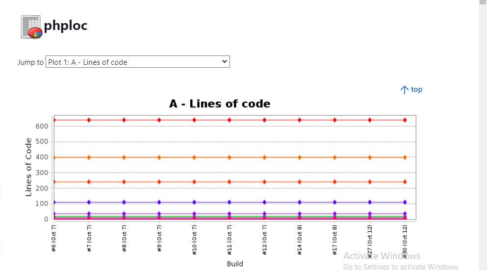

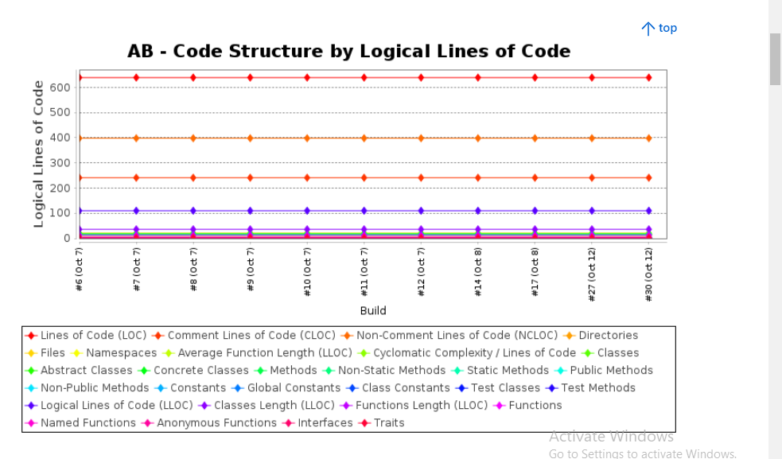

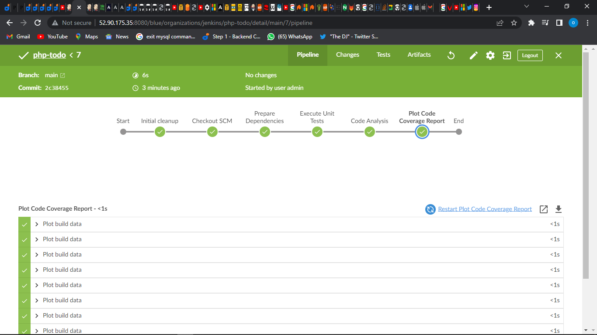

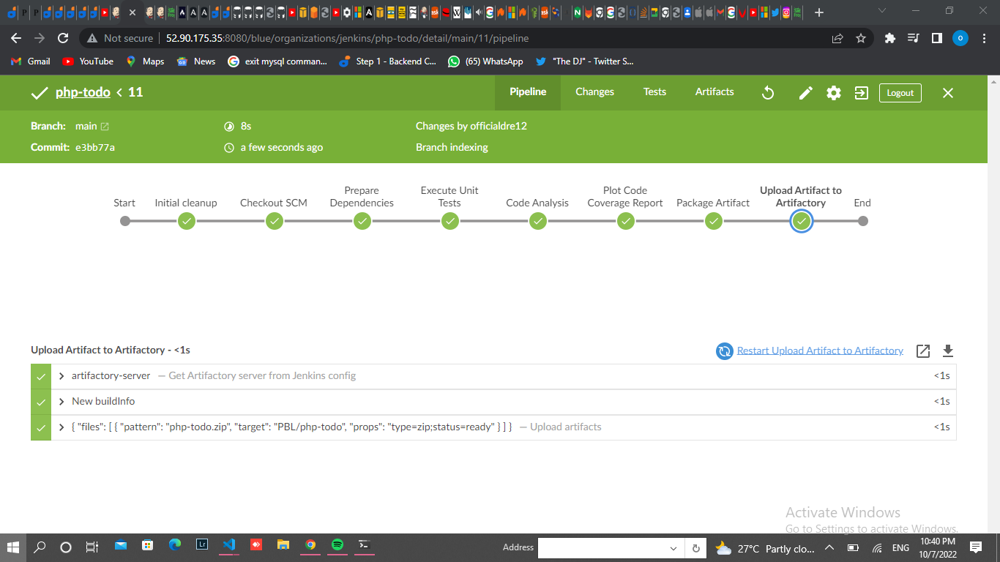

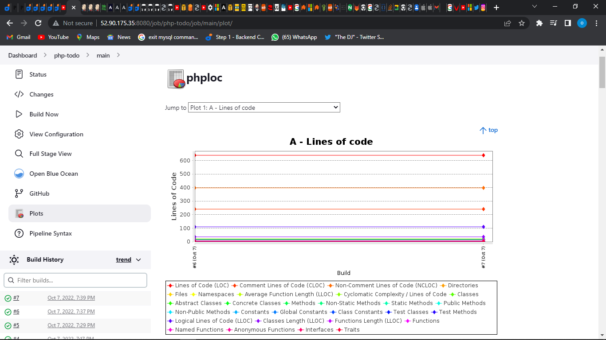

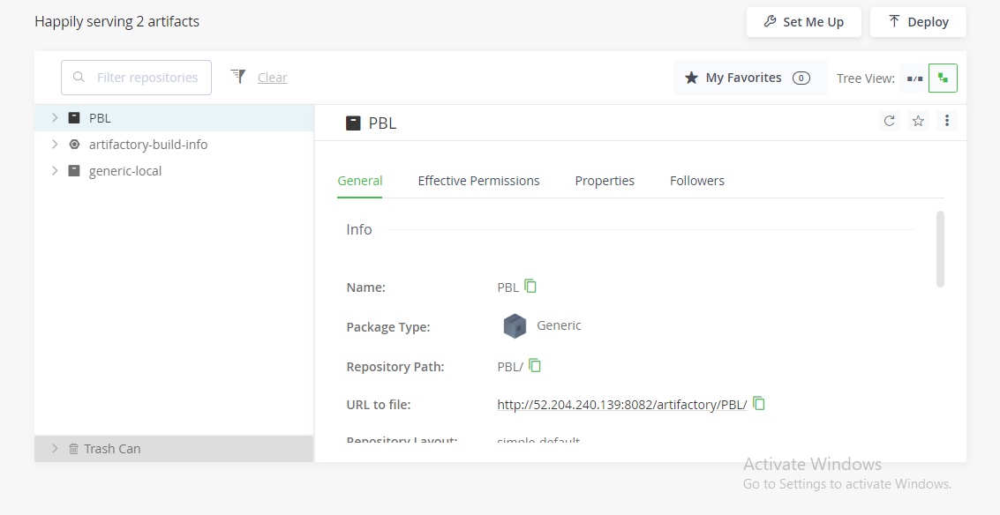

The build job used in this step tells Jenkins to start another job. In this case it is the ansible-project job, and we are targeting the main branch. Hence, we have ansible-project/main. Meaning, deploy to the Development environment.

Now for quality code testing we would be installing and configuring Sonarqube .

Already set up a sonarqube role on ansible will run the playbook for installation now 


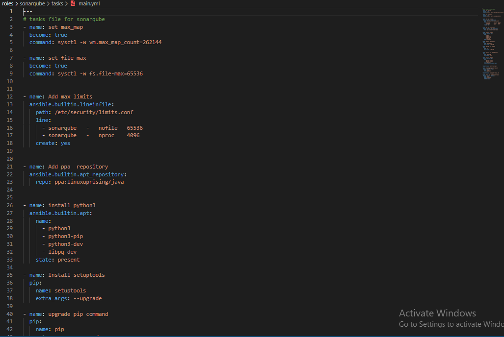


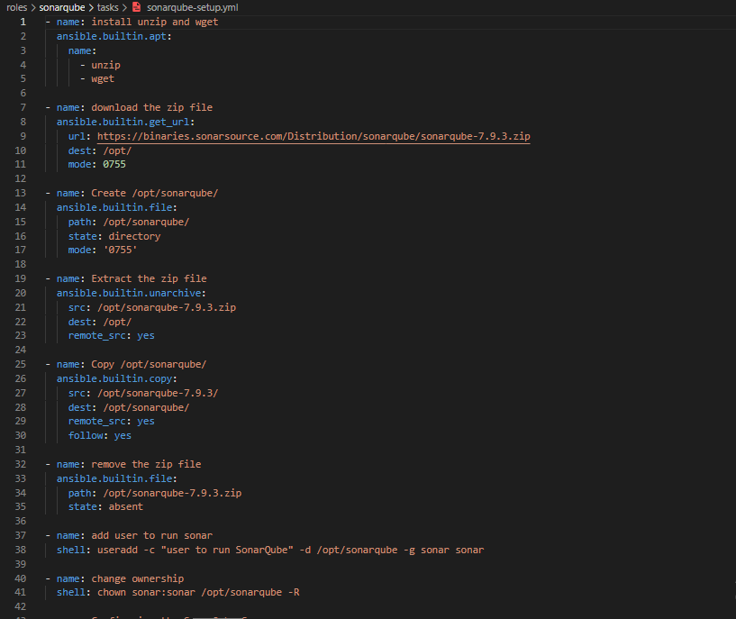

Images above shows our Configured sonarqube playbook ready for execution.


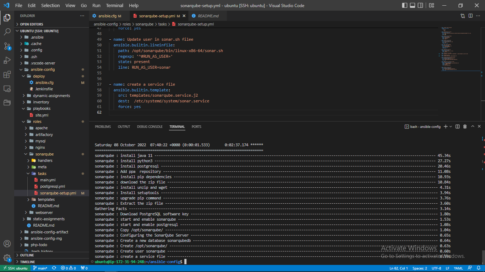

Above image shows that we have succesfuly installed sonarqube on our server.

lets head over to the browser.
Login to SonarQube with default administrator username and password – admin

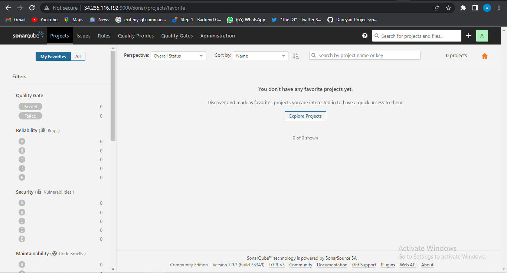

Now we head over to jenkins to configure our quality gates.

In jenkins UI install sonarscanner plugin. Navigate to configure systems and add the sonarqube and path.

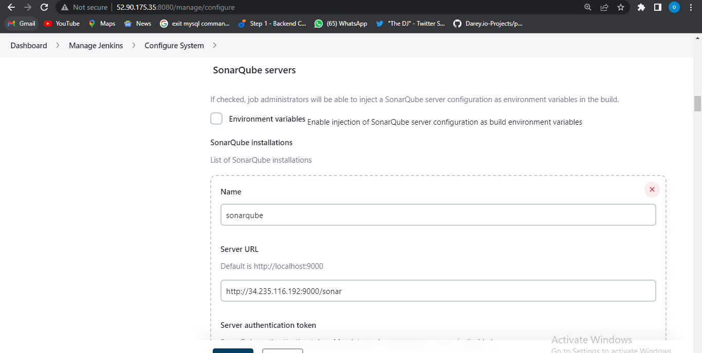

Configure Quality Gate Jenkins Webhook in SonarQube – The URL should point to your Jenkins server.


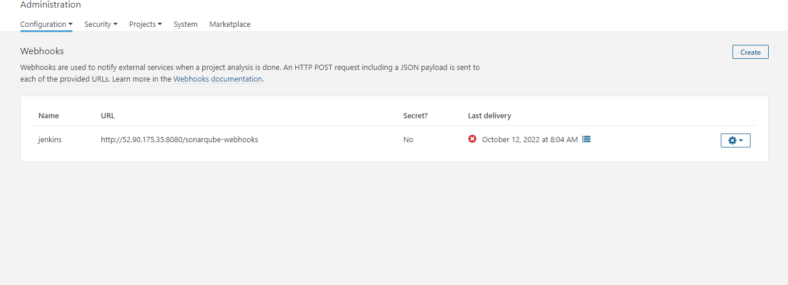

Now we setup SonarQube scanner from Jenkins – Global Tool Configuration.

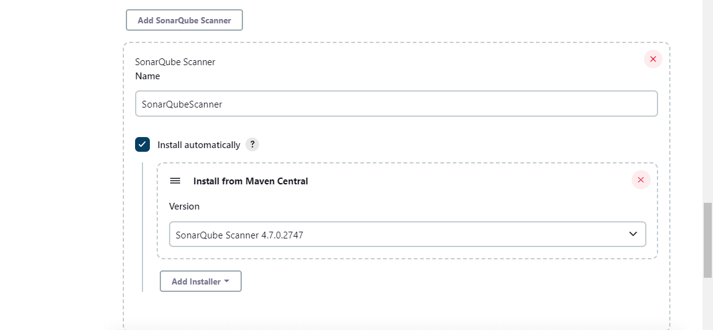

Now we update our jenkins file to include quality gate.
```
 stage('SonarQube Quality Gate') {
        environment {
            scannerHome = tool 'SonarQubeScanner'
        }
        steps {
            withSonarQubeEnv('sonarqube') {
                sh "${scannerHome}/bin/sonar-scanner"
            }

        }
    }
```
Input the above code into the jenkins file and push 
this is expected to fail because we have not updated sonar-scanner properties.


Now we go into the tools directory on the server to configure the properties file in which SonarQube will require to function during pipeline execution.
```
cd /var/lib/jenkins/tools/hudson.plugins.sonar.SonarRunnerInstallation/SonarQubeScanner/conf/
```

Open scanner properties file `sudo vi sonar-scanner.properties`

Add configuration related to php-todo project

```
sonar.host.url=http://<SonarQube-Server-IP-address>:9000
sonar.projectKey=php-todo
#----- Default source code encoding
sonar.sourceEncoding=UTF-8
sonar.php.exclusions=**/vendor/**
sonar.php.coverage.reportPaths=build/logs/clover.xml
sonar.php.tests.reportPath=build/logs/junit.xml
```

configure accordingly and run the pipelina again 

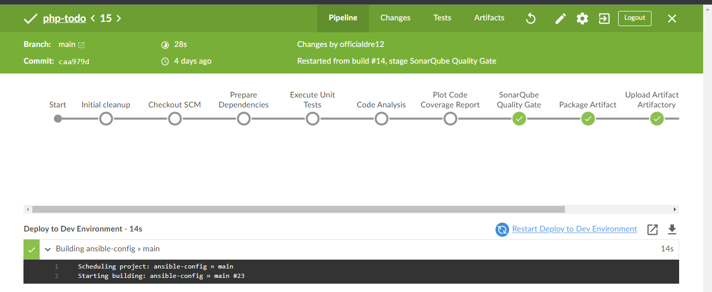

the pipeline deployed succesfuly but we are not done.The quality gate we just included has no effect.

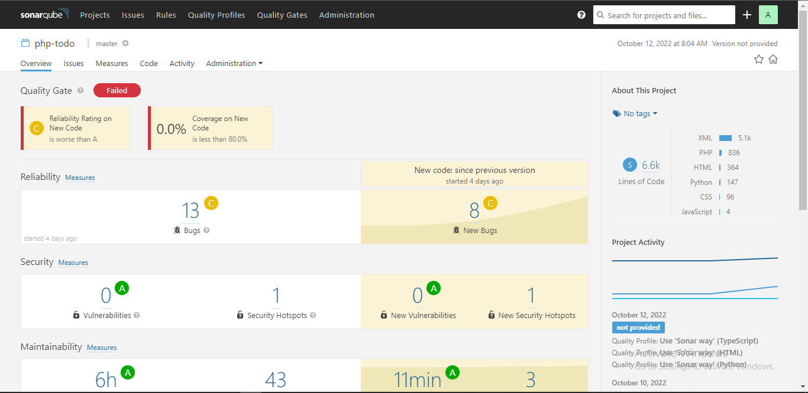

The above image just showed that the code we deployed is poor quality.
From the result it shows that there are bugs, and there is 0.0% code coverage(code coverage is a percentage of unit tests added by developers to test functions and objects in the code) and there is 6 hours’ worth of technical debt, code smells and security issues in the code. And therefore as DevOps Engineer working on the pipeline, we must ensure that the quality gate step causes the pipeline to fail if the conditions for quality are not met.
- To ensure that only pipeline job that is run on either 'main' or 'develop' or 'hotfix' or 'release' branch gets to make it to the deploy stage, the Jenkinsfile is updated and a timeout step is also added to wait for SonarQube to complete analysis and successfully finish the pipeline only when code quality is acceptable.

```
   stage('SonarQube Quality Gate') {
      when { branch pattern: "^develop*|^hotfix*|^release*|^main*", comparator: "REGEXP"}
        environment {
            scannerHome = tool 'SonarQubeScanner'
        }
        steps {
            withSonarQubeEnv('sonarqube') {
                sh "${scannerHome}/bin/sonar-scanner -Dproject.settings=sonar-project.properties"
            }
            timeout(time: 1, unit: 'MINUTES') {
                waitForQualityGate abortPipeline: true
            }
        }
    }
```

The above is the updated quality gate.


Now we commit and push the changes to see the effect of our configurations.


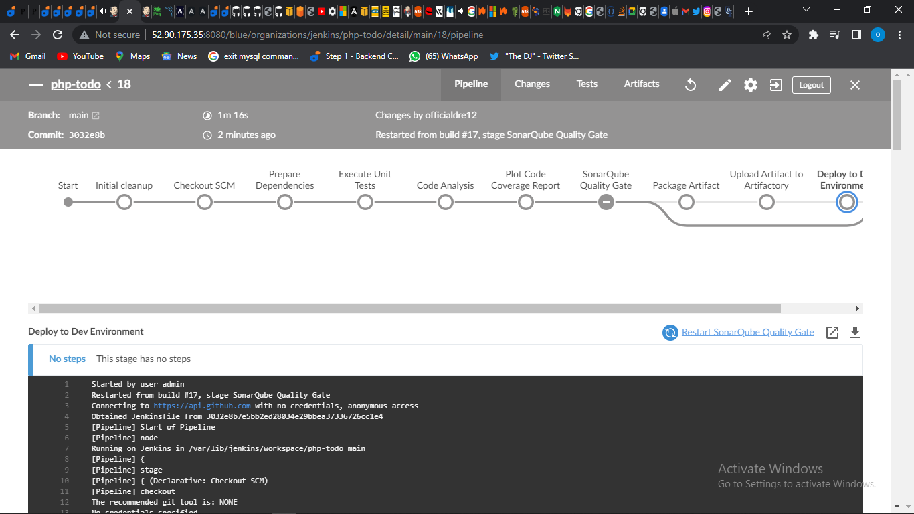


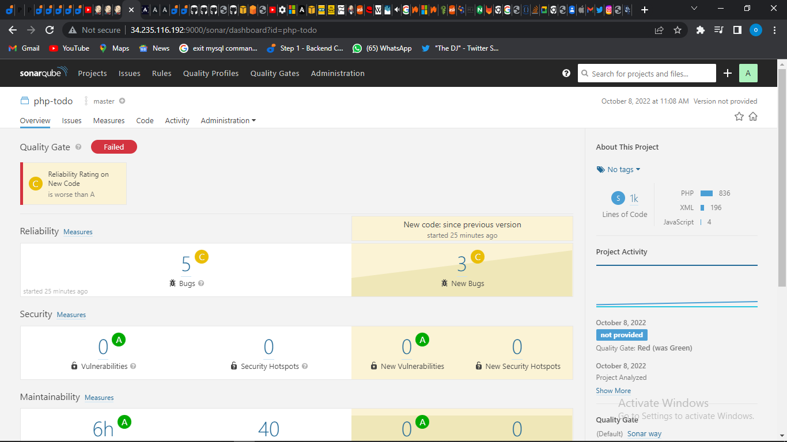

the above image shows that our configuration and the pipeline was aborted because of poor quality of the code


Running the Pipeline Job with 2 Jenkins agents/slaves(Nodes)
- Creating a new node and naming it 'sonar'
- Configuring the settings and labelling it 'slaveNode1'
- Do the same for the second node 
- launch the nodes created


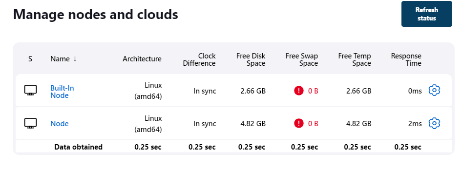

- Updating the Jenkinsfile in the agent section to be able to run the pipeline on the two nodes randomly

```
pipeline {
    agent  { label 'slaveNode1' `slaveNode2` }
```


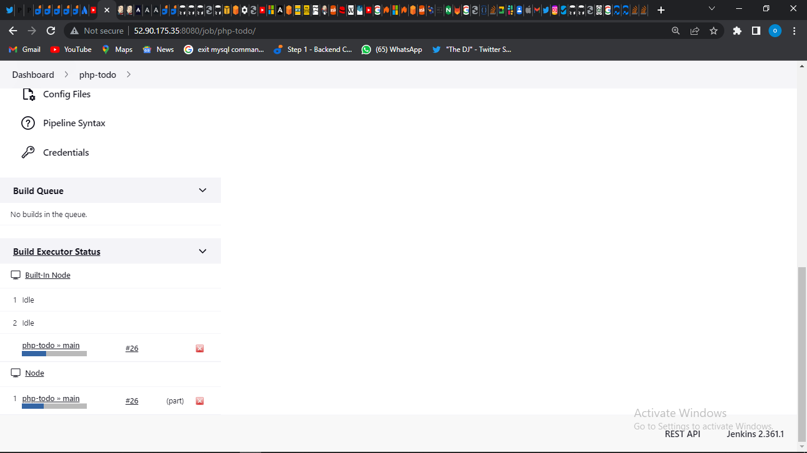

Above image shows the nodes executing jobs randomly.


Also we have been to deploy the todoapp to all our webservers.

# END!